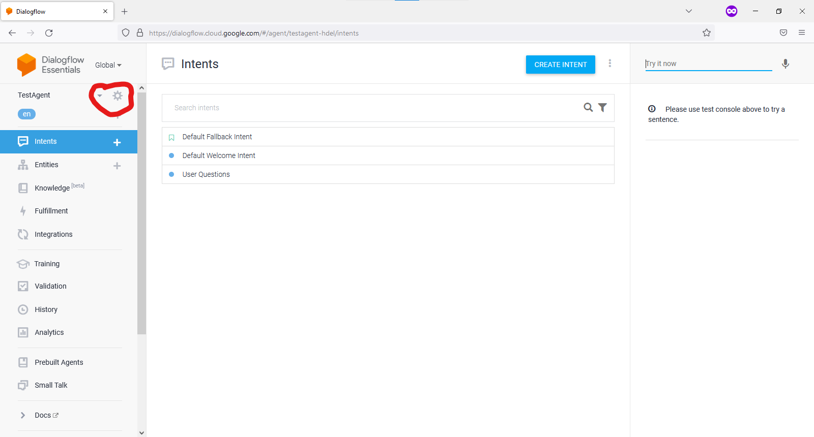
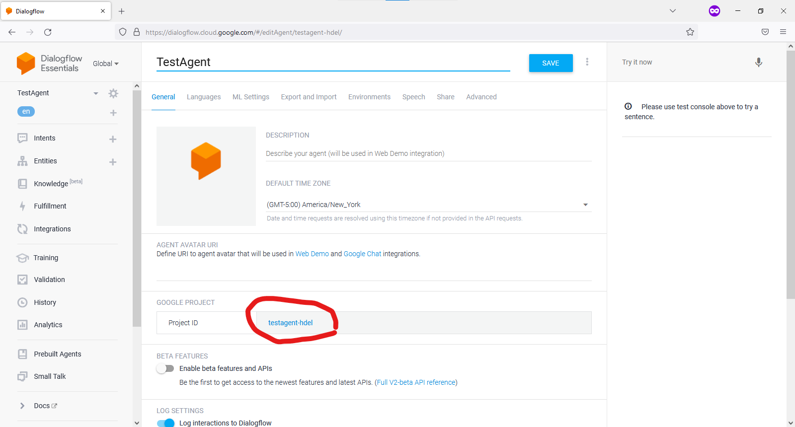

# Google Dialogflow

## Setting up Google Dialogflow Console

1. Open the google dialogflow console in a web browser. [Google Dialogflow Console](https://dialogflow.cloud.google.com/)

2. Sign in with __PERSONAL__ google account (Do not use KSU email address for this because KSU account has some restrictions for creating projects in GCP)

3. From the navigation menu on the left, find the option where it says __CREATE AGENT__. Select that one.

4. Give your conversation agent a name. We'll need this name when we are writing codes for Dialogflow agent.

5. Two default intents are present in there. (Default fallback intent and Default Welcome Intent)

6. On the top right, find the button that says "CREATE INTENT". Create a new intent with this button.

7. Click on __ADD TRAINING PHRASES__. Here you can add what do you want the conversation to be like.

8. You can add multiple intents to handle a specific set of user expressions (what the users might say for a specific task). 

## Using Dialogflow API to communicate with Agent

Dialogflow can be tested in the dialogflow console itself. On the left it has a prompt where one can enter text to get the result. But, we need the results in a programming environment. Dialogflow provides multiple APIs to communicate with the Agent and also provides REST API that can communicate with the dialogflow API over HTTP. 

### Initializing Google Cloud CLI

For authentication and communicating using the API we need to install Google Cloud CLI and set it up with our google account. Following steps initializes it and sets up with our credentials. The steps are for Ubuntu / Debian operating systems. 

Open a new terminal and follow these steps to get started.

1. Install apt-transport-https ca-certificates and gnupg

        sudo apt-get install apt-transport-https ca-certificates gnupg

2. Add the gcloud CLI distribution URI as a package source.

        echo "deb [signed-by=/usr/share/keyrings/cloud.google.gpg] https://packages.cloud.google.com/apt cloud-sdk main" | sudo tee -a /etc/apt/sources.list.d/google-cloud-sdk.list

3. Import the Google Cloud public key
        
        curl https://packages.cloud.google.com/apt/doc/apt-key.gpg | sudo apt-key --keyring /usr/share/keyrings/cloud.google.gpg add -

4. Update and install the gcloud CLI: 

        sudo apt-get update && sudo apt-get install google-cloud-cli

5. Run `gcloud init` to get started:

        gcloud init

### Using Python Client Library

For this step, we are going to need the __PROJECT_ID__ for the Dialogflow Agent that was created. Follow these steps to get the __PROJECT_ID__.

1. Go to DialogFlow console home. [Link](https://dialogflow.cloud.google.com/)

2. On the left menu, the agent name with the relevant settings should be shown. Click on the cogwheel icon to enter the settings for the agent.

3. In the project settings, the __PROJECT_ID__ should be present.

4. Note down this project id as we will need this project id in later steps.

5. Install the dialogflow python library. Open a new terminal and type in the following command.

        pip install google-cloud-dialogflow

6. Download the python source file from src/main.py. Or run the following command that will save the file in a file named `main.py`.

        curl https://raw.githubusercontent.com/ksu-cs-robotics/Human-Robot-Interaction/main/tutorials/conversational-agent/src/main.py > main.py

7. Open the python file with any editor (Visual Studio Code, gedit, nano, vim) and find where it says `PROJECT_ID = 'smarttrashcan-wbmh'`. Update this line with your own project id.

8. Run this code with the following command 

        python main.py

9. It should prompt you for messages that will be passed to google dialogflow agent. Enter `quit` anytime to exit the script.

    
